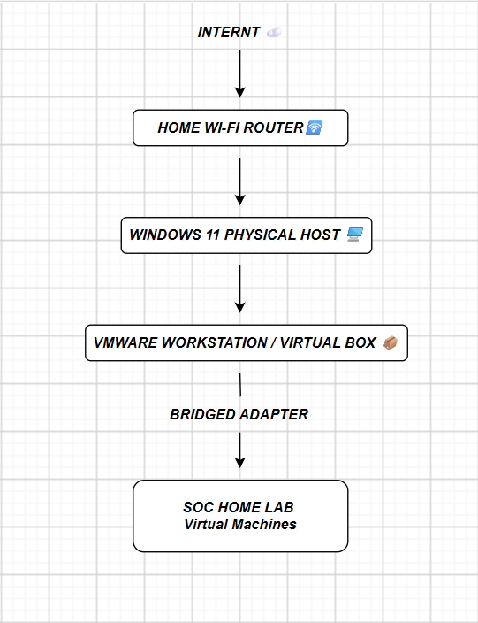
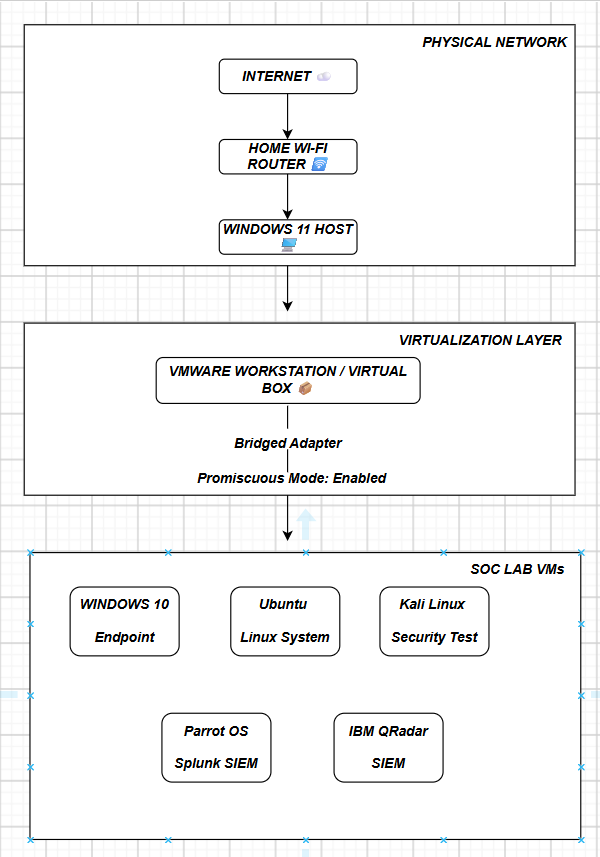

# 01 — Physical Network

## Overview

This section documents the physical network foundation of my
SOC home lab.

The lab is hosted on a physical **Windows 11** computer connected
to the home network through **Wi-Fi**. **VMware Workstation** runs
the virtual machines, which use a **bridged network adapter** to
connect through the host's network connection.

---

## Network Architecture

### Network Overview

### Detailed Home Lab Network Diagram

---

## 1. Home Network Concept

The SOC home lab uses my existing home Wi-Fi network as the
physical network foundation.

The physical Windows 11 computer connects to the home router
using Wi-Fi.

VMware Workstation runs on this physical computer and hosts
the virtual machines used in the SOC laboratory.

The virtual machines are configured to use bridged networking,
which allows their virtual network interfaces to connect
through the physical host's network connection.

The physical network therefore provides the connectivity
foundation for the virtual SOC environment.

---

## 2. Internet

The Internet provides external network connectivity to the
home network.

The Internet connection is provided through the home Wi-Fi
router.

No personal Internet information or public IP address is
included in this repository.

---

## 3. Home Wi-Fi Router

The home Wi-Fi router provides the local network used by the
physical host.

It provides wireless connectivity between the physical
Windows 11 computer and the local network.

The router also provides the connection between the local
network and the Internet.

---

## 4. Physical Host — Windows 11

The physical host runs Windows 11 and provides the hardware
resources for the entire SOC laboratory.

VMware Workstation is installed on the host and is responsible
for running the individual virtual machines.

The physical host connects to the home network through Wi-Fi.

---

## 5. VMware Workstation

VMware Workstation provides the virtualization layer of the
SOC home lab.

It allows multiple operating systems to run independently as
virtual machines on the Windows 11 physical host.

The laboratory contains the following virtual machines:

| Virtual Machine | Primary Role |
|---|---|
| Windows 10 | Endpoint |
| Parrot OS | Splunk SIEM |
| Ubuntu | Linux System |
| IBM QRadar | SIEM |
| Kali Linux | Security Testing |

Each virtual machine has its own virtual hardware and
network interface.

The individual virtual machines and their configurations are
documented in later sections of this project.

---

## 6. Bridged Networking

The virtual machines use a bridged network adapter in VMware
Workstation.

In this configuration, the virtual machine's network
interface is connected through the physical host's network
connection.

In this laboratory, the physical host uses Wi-Fi.

The simplified network path is:

Physical Windows 11 Host
 ➜ 
Physical Wi-Fi Network Adapter
 ➜ 
VMware Workstation
 ➜ 
Bridged Virtual Network Adapter
 ➜ 
Virtual Machine

Bridged networking was selected to allow the virtual
machines to participate in the same network environment as
the physical host, subject to the configuration of the
network and the individual virtual machines.

---

## 7. Why Bridged Networking Was Selected

Bridged networking was selected because the SOC laboratory
requires realistic network communication between the
virtual machines and the surrounding network environment.

A bridged configuration allows the virtual machines to use
the physical host's network connection rather than relying
only on an isolated NAT-based virtual network.

This is useful for a SOC laboratory because the systems can
communicate using normal IP networking and can generate
network and security activity that can be used for monitoring,
logging, detection, and investigation.

The choice of bridged networking also makes the network
architecture easier to understand because the virtual
machines are connected through the same physical network
path used by the Windows 11 host.

---

## 8. Promiscuous Mode

Promiscuous mode is enabled as part of the VMware network
configuration.

Promiscuous mode controls which network frames a virtual network
interface is allowed to receive. However, enabling it does not
automatically provide visibility into all traffic on the physical
Wi-Fi network.

Actual traffic visibility depends on the network topology,
wireless adapter capabilities, VMware configuration, and the
specific monitoring setup.

---

## 9. How the Virtual Machines Communicate

The virtual machines communicate through their configured
virtual network interfaces.

The general communication path is:

Internet
 ➜ 
Home Wi-Fi Router
 ➜ 
Local Wi-Fi Network
 ➜ 
Windows 11 Physical Host
 ➜ 
VMware Workstation
 ➜ 
Bridged Network Adapter
 ➜ 
SOC Virtual Machines

The virtual machines can communicate with one another
according to their IP addresses, firewall configurations,
virtual network settings, and other network controls.

For example, the Windows 10 endpoint can communicate with
other systems in the laboratory when the required network
connectivity is configured.

The SIEM systems can communicate with configured log sources
when the required network and logging configurations are in
place.

---

## 10. SOC Virtual Machines

The physical host runs several virtual machines that form the
SOC laboratory.

### Windows 10

Windows 10 is used as an endpoint system in the laboratory.

It can generate Windows security and system activity that
can be used as telemetry for security monitoring and
investigation.

### Parrot OS

Parrot OS is used as the host operating system for Splunk in
this laboratory.

Splunk provides the SIEM and security monitoring capabilities
used in the project.

### Ubuntu

Ubuntu is used as a Linux system within the laboratory.

It can be used as a Linux system and, where configured, as a
source of system and security logs.

### IBM QRadar

IBM QRadar is deployed as a separate virtual machine.

QRadar provides the second SIEM platform used in the
laboratory for event collection, monitoring, detection, and
investigation.

### Kali Linux

Kali Linux is used as the security testing system.

It is used to generate controlled security-testing activity
against systems that are intentionally included in the
laboratory.

All testing is performed only against authorized laboratory
systems.

---
## Security Considerations

This is an educational and controlled SOC home laboratory.

Security testing is performed only against systems intentionally
included in the lab.

Because the virtual machines use bridged networking, care must be
taken to avoid unintended interaction with unrelated devices on
the home network.

The following information should never be committed to the
public repository:
- Passwords and credentials
- API keys and authentication tokens
- Private SSH keys
- Wi-Fi credentials
- Public IP addresses
- Personal information
- Sensitive network configuration

---
