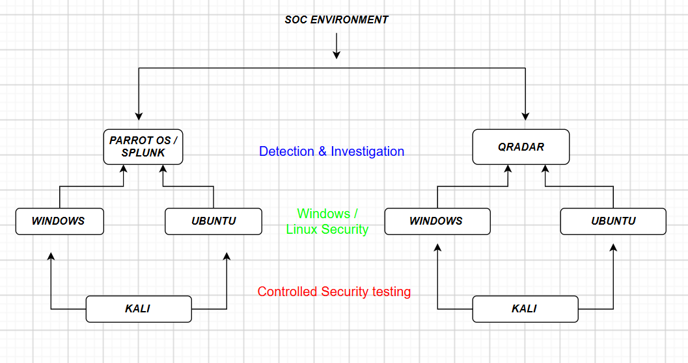

# 03 — Virtualization Platform and Operating Systems Installation

This section provides video resources for installing and configuring the virtualization platforms and deploying the operating systems used in the SOC home lab.

The virtualization configuration should follow the requirements documented in:

[Virtualization Requirements](../02-virtualization-requirements/README.md)

---

## 1. VMware Workstation

### VMware Workstation Installation & Configuration

Follow this video resource to download, install, and configure VMware Workstation:

[Watch VMware Workstation Installation & Configuration](https://youtu.be/lNGXSrZB_2A?si=mg-Kk52uLSlWRxgq)

---

## 2. Oracle VirtualBox

### Oracle VirtualBox Installation & Configuration

Follow this video resource to download, install, and configure Oracle VirtualBox:

[Watch Oracle VirtualBox Installation & Configuration](https://youtu.be/homRENM8KVY?si=W4LYZ7CJdc1WaEmC)

---

# 3. Windows 10 Installation

## 3.1 Windows 10 — VMware Workstation

Follow this video resource to download and install Windows 10 using VMware Workstation:

[Watch Windows 10 Installation on VMware Workstation](https://youtu.be/-85D8WIKaCc?si=cKBECEE5B1iguIit)

### Recommended Configuration

Use the Windows 10 VM resource allocation documented in the virtualization requirements:

- CPU: 4 cores
- RAM: 6 GB
- Storage: 50 GB
- Network: Bridged Adapter

---

## 3.2 Windows 10 — Oracle VirtualBox

Follow this video resource to download and install Windows 10 using Oracle VirtualBox:

[Watch Windows 10 Installation on Oracle VirtualBox](https://youtu.be/XvZ45lsrG4A?si=RUI40KDhORTgdxuQ)

### Recommended Configuration

Use the Windows 10 VM resource allocation documented in the virtualization requirements:

- CPU: 4 cores
- RAM: 6 GB
- Storage: 50 GB
- Network: Bridged Adapter

---

# 4. Ubuntu Installation

## 4.1 Ubuntu — VMware Workstation

Follow this video resource to download and install Ubuntu using VMware Workstation:

[Watch Ubuntu Installation on VMware Workstation](https://youtu.be/SgfrHKg81Qc?si=JQ2y4T3iFCJaHbC0)

### Recommended Configuration

Use the Ubuntu VM resource allocation documented in the virtualization requirements:

- CPU: 2 cores
- RAM: 3 GB
- Storage: 30 GB
- Network: Bridged Adapter

Ubuntu is used as a Linux security telemetry source in the SOC lab.

---

## 4.2 Ubuntu — Oracle VirtualBox

Follow this video resource to download and install Ubuntu using Oracle VirtualBox:

[Watch Ubuntu Installation on Oracle VirtualBox](https://youtu.be/nCZcTKFbD2Q?si=wMeUwq73mYwnClv-)

### Recommended Configuration

Use the Ubuntu VM resource allocation documented in the virtualization requirements:

- CPU: 2 cores
- RAM: 3 GB
- Storage: 30 GB
- Network: Bridged Adapter

---

# 5. Kali Linux Installation

## 5.1 Kali Linux — VMware Workstation

Follow this video resource to download and install Kali Linux using VMware Workstation:

[Watch Kali Linux Installation on VMware Workstation](https://youtu.be/XzD8JIAOk2I?si=nyGNcJMkZ7bIJyS1)

### Recommended Configuration

Use the Kali Linux VM resource allocation documented in the virtualization requirements:

- CPU: 2 cores
- RAM: 3 GB
- Storage: 40 GB
- Network: Bridged Adapter

Kali Linux is used as the primary controlled security-testing and attack-simulation workstation.

---

## 5.2 Kali Linux — Oracle VirtualBox

Follow this video resource to download and install Kali Linux using Oracle VirtualBox:

[Watch Kali Linux Installation on Oracle VirtualBox](https://youtu.be/ZJFu0AoAY_g?si=iurUuQ41cHus14S6)

### Recommended Configuration

Use the Kali Linux VM resource allocation documented in the virtualization requirements:

- CPU: 2 cores
- RAM: 3 GB
- Storage: 40 GB
- Network: Bridged Adapter

---

# 6. Parrot OS Installation

## 6.1 Parrot OS — VMware Workstation

Follow this video resource to download and install Parrot OS using VMware Workstation:

[Watch Parrot OS Installation on VMware Workstation](https://youtu.be/Ww9-iygppuQ?si=Gq4SbxKZJR4hBfmv)

### Recommended Configuration

Use the Parrot OS VM resource allocation documented in the virtualization requirements:

- CPU: 4 cores
- RAM: 4 GB
- Storage: 80 GB
- Network: Bridged Adapter

Parrot OS is used to host Splunk and also provides security analysis capabilities within the SOC lab.

---

## 6.2 Parrot OS — Oracle VirtualBox

Follow this video resource to download and install Parrot OS using Oracle VirtualBox:

[Watch Parrot OS Installation on Oracle VirtualBox](https://youtu.be/WhcuhiVYp94?si=jvhROODtT5s6ef_j)

### Recommended Configuration

Use the Parrot OS VM resource allocation documented in the virtualization requirements:

- CPU: 4 cores
- RAM: 4 GB
- Storage: 80 GB
- Network: Bridged Adapter

---

## VM Usage Strategy

The SOC home lab does not require all virtual machines to run simultaneously. 
The virtual machines are started selectively depending on the operating system 
being monitored and the SIEM platform being used.

This approach reduces the CPU, RAM, and storage requirements on the physical 
host while allowing different SOC detection and investigation scenarios to 
be performed.

The lab uses the following combinations instead of running all VMs simultaneously:

---
